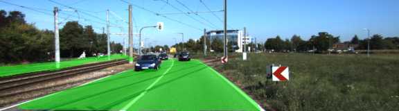

# Semantic Segmentation
### Introduction
In this project, you'll label the pixels of a road in images using a Fully Convolutional Network (FCN).

This implementation is summarized in the following five steps:

- **Load VGG16 model**
- **Build FCN**
- **Select optimizer**
- **Training model**
- **Eveluate model**

#### Load VGG16 model[in main.py line 20 to 43](./main.py#L20-L43)
```
    #Use tf.saved_model.loader.load to load the model and weights
    vgg_tag = 'vgg16'
    vgg_input_tensor_name = 'image_input:0'
    vgg_keep_prob_tensor_name = 'keep_prob:0'
    vgg_layer3_out_tensor_name = 'layer3_out:0'
    vgg_layer4_out_tensor_name = 'layer4_out:0'
    vgg_layer7_out_tensor_name = 'layer7_out:0'

    tf.saved_model.loader.load(sess, [vgg_tag], vgg_path)
    image_input = tf.get_default_graph().get_tensor_by_name(vgg_input_tensor_name)
    keep_prob = tf.get_default_graph().get_tensor_by_name(vgg_keep_prob_tensor_name)
    layer3_out = tf.get_default_graph().get_tensor_by_name(vgg_layer3_out_tensor_name)
    layer4_out = tf.get_default_graph().get_tensor_by_name(vgg_layer4_out_tensor_name)
    layer7_out = tf.get_default_graph().get_tensor_by_name(vgg_layer7_out_tensor_name)
    
    return image_input, keep_prob, layer3_out, layer4_out, layer7_out
```
The string value of `vgg_tag` and `tensor_name` should keep pace with the tensor name(`./data/vgg/saved_model.pb`). You can run the following code segment, if you are not sure the tensor name.

```
tf.saved_model.loader.load(sess,[vgg_tag], vgg_path)
for op in sess.graph.get_operations():
	print(op.name, op.values())
```

#### Build FCN[in main.py line 47 to 95](./main.py#L47-L95)

<div  align="center">    

</div>

#### Select optimizer[in main.py line 99 to 118](./main.py#L99-L118)

```
    # TODO: Implement function
    # make logits a 2D tensor where each row represents a pixel and each column a class
    logits = tf.reshape(nn_last_layer, (-1, num_classes))
    correct_label = tf.reshape(correct_label, (-1,num_classes))
    # define loss function
    cross_entropy_loss = tf.reduce_mean(tf.nn.softmax_cross_entropy_with_logits(logits= logits, labels= correct_label))
    # define training operation
    optimizer = tf.train.AdamOptimizer(learning_rate= learning_rate)
    train_op = optimizer.minimize(cross_entropy_loss)

    return logits, train_op, cross_entropy_loss
```

#### Training model[in main.py line 138 to 148](./main.py#L138-L148)

#### Eveluate model

Results are as follows:
<div  align="center">    


</div>


### Setup
##### GPU
`main.py` will check to make sure you are using GPU - if you don't have a GPU on your system, you can use AWS or another cloud computing platform.
##### Frameworks and Packages
Make sure you have the following is installed:
 - [Python 3](https://www.python.org/)
 - [TensorFlow](https://www.tensorflow.org/)
 - [NumPy](http://www.numpy.org/)
 - [SciPy](https://www.scipy.org/)
##### Dataset
Download the [Kitti Road dataset](http://www.cvlibs.net/datasets/kitti/eval_road.php) from [here](http://www.cvlibs.net/download.php?file=data_road.zip).  Extract the dataset in the `data` folder.  This will create the folder `data_road` with all the training a test images.

### Start
##### Implement
Implement the code in the `main.py` module indicated by the "TODO" comments.
The comments indicated with "OPTIONAL" tag are not required to complete.
##### Run
Run the following command to run the project:
```
python main.py
```
**Note** If running this in Jupyter Notebook system messages, such as those regarding test status, may appear in the terminal rather than the notebook.

### Submission
1. Ensure you've passed all the unit tests.
2. Ensure you pass all points on [the rubric](https://review.udacity.com/#!/rubrics/989/view).
3. Submit the following in a zip file.
 - `helper.py`
 - `main.py`
 - `project_tests.py`
 - Newest inference images from `runs` folder  (**all images from the most recent run**)
 
 ### Tips
- The link for the frozen `VGG16` model is hardcoded into `helper.py`.  The model can be found [here](https://s3-us-west-1.amazonaws.com/udacity-selfdrivingcar/vgg.zip).
- The model is not vanilla `VGG16`, but a fully convolutional version, which already contains the 1x1 convolutions to replace the fully connected layers. Please see this [post](https://s3-us-west-1.amazonaws.com/udacity-selfdrivingcar/forum_archive/Semantic_Segmentation_advice.pdf) for more information.  A summary of additional points, follow. 
- The original FCN-8s was trained in stages. The authors later uploaded a version that was trained all at once to their GitHub repo.  The version in the GitHub repo has one important difference: The outputs of pooling layers 3 and 4 are scaled before they are fed into the 1x1 convolutions.  As a result, some students have found that the model learns much better with the scaling layers included. The model may not converge substantially faster, but may reach a higher IoU and accuracy. 
- When adding l2-regularization, setting a regularizer in the arguments of the `tf.layers` is not enough. Regularization loss terms must be manually added to your loss function. otherwise regularization is not implemented.
 
### Using GitHub and Creating Effective READMEs
If you are unfamiliar with GitHub , Udacity has a brief [GitHub tutorial](http://blog.udacity.com/2015/06/a-beginners-git-github-tutorial.html) to get you started. Udacity also provides a more detailed free [course on git and GitHub](https://www.udacity.com/course/how-to-use-git-and-github--ud775).

To learn about REAMDE files and Markdown, Udacity provides a free [course on READMEs](https://www.udacity.com/courses/ud777), as well. 

GitHub also provides a [tutorial](https://guides.github.com/features/mastering-markdown/) about creating Markdown files.
